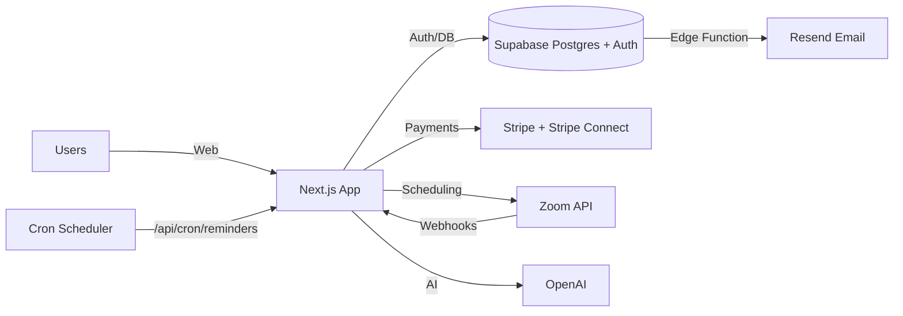

## Portal Owner Manual

Last updated: 2026-03-15

This manual describes the technical setup and day-to-day operations for the portal. It is designed so a technical owner, developer, or operations team member can take over without prior context.

**Scope**

- High-level architecture and component interactions
- Hosting and infrastructure overview
- External services and integrations
- Codebase structure and local setup
- Database overview and backup/restore
- Admin and operations workflows
- Configuration, monitoring, and maintenance

## High-Level Architecture

**Tech stack**

- Frontend and backend: Next.js 16 (App Router), React 19, TypeScript
- Database and auth: Supabase (Postgres + Auth + RLS)
- Payments: Stripe (Checkout) and Stripe Connect (mentor payouts)
- Video and transcripts: Zoom (server-to-server OAuth, webhooks, cloud recordings)
- AI: OpenAI (embeddings and report generation)
- Email: Resend (via Supabase Edge Function)
- Styling: Tailwind CSS v4 + PostCSS

**Component interaction summary**

- Web app and API routes run in the Next.js app.
- Supabase provides database, auth, RLS enforcement, and Edge Functions.
- Stripe handles payments for credit packages and mentor payouts.
- Zoom handles session scheduling, and webhooks update session status and trigger report generation.
- OpenAI is used for mentor matching (embeddings) and session report generation.
- A cron job hits a Next.js API route to send session reminders.

**System diagram**

## Hosting and Infrastructure

**Current hosting**

- The portal is hosted and deployed on Vercel edge network.

**Environments**

- **Production Supabase project**: `msssqttbhlnwypnsewgl`
- **Dev Supabase project**: `rnzqhealsnpkswnjlrxp`
- **Production deployment**: Vercel, auto-deploys from `main` branch (`https://accessoxbridge.vercel.app`)
- Local development uses `.env.local` pointed at the dev Supabase project.

**Branching and deployment**

- `main` branch = production. Vercel auto-deploys on push.
- `dev` branch = development. Merge into `main` when ready to ship.
- Both branches should stay in sync. After merging `dev` into `main`, the branches should be at the same commit.

**Backups and recovery**

- All code is stored and backed up in GitHub (`AccessOxbridge/portal`).
- Supabase provides automated Postgres backups and point-in-time restore depending on plan.
- A manual prod database backup was taken on 2026-03-15 before the dev-to-prod migration.

## External Services, APIs, and Integrations

**Supabase**

- Used for Postgres database, authentication, RLS policies, and Edge Functions.
- Configuration:
  - `NEXT_PUBLIC_SUPABASE_URL`
  - `NEXT_PUBLIC_SUPABASE_PUBLISHABLE_DEFAULT_KEY` (anon key)
  - `SUPABASE_SERVICE_ROLE_KEY`
- Supabase Edge Function: `supabase/functions/send-email-notifications/index.ts`
- The Edge Function requires `RESEND_API_KEY` set as a **Supabase Edge Function secret** (not just Vercel env var) for email delivery to work.
- The notification trigger (`handle_new_notification`) calls the Edge Function via `extensions.http_post`. It includes error handling so a failed email does not roll back the notification INSERT.

**Stripe and Stripe Connect**

- Used for credit package purchases and mentor payouts.
- Configuration:
  - `STRIPE_SECRET_KEY`
  - `NEXT_PUBLIC_STRIPE_PUBLISHABLE_KEY`
  - `STRIPE_WEBHOOK_SECRET`
  - `STRIPE_CONNECT_WEBHOOK_SECRET`
- Webhook handlers:
  - `/app/api/webhooks/stripe/route.ts`
  - `/app/api/webhooks/stripe-connect/route.ts`

**Zoom**

- Used for creating scheduled meetings, recording, and transcripts.
- Configuration:
  - `ZOOM_ACCOUNT_ID`
  - `ZOOM_CLIENT_ID`
  - `ZOOM_CLIENT_SECRET`
  - `ZOOM_WEBHOOK_SECRET_TOKEN`
- Webhook handler:
  - `/app/api/webhooks/zoom/route.ts`

**OpenAI**

- Used for mentor matching (embeddings) and session report generation.
- Configuration:
  - `OPEN_AI_API_KEY`
- Usage:
  - `/app/api/match-mentors/route.ts`
  - `/utils/reports.ts`

**Resend**

- Used for email notifications via Supabase Edge Function.
- Configuration:
  - `RESEND_API_KEY` (must be set in both Vercel env vars AND Supabase Edge Function secrets)
- Edge Function:
  - `/supabase/functions/send-email-notifications/index.ts`

**Cron scheduler**

- External scheduler is required to call `/api/cron/reminders` every 10-15 minutes.
- Implemented in GitHub Actions: `.github/workflows/reminders.yml` (runs every 15 minutes and supports manual `workflow_dispatch`).
- **Configuration (app env):** `CRON_SECRET` (optional; if set, the cron request must send `Authorization: Bearer <CRON_SECRET>`).
- **GitHub Actions secrets (required for the workflow):**
  - `SITE_URL`: Base URL of the app to hit (e.g. `https://accessoxbridge.vercel.app`). This controls which environment the cron hits.
  - `CRON_SECRET`: Must match the `CRON_SECRET` in the app's environment variables for that deployment.
- **Scheduled runs use the default branch:** The workflow that runs on the schedule is the one on the repository's default branch (e.g. `main`).

**Other config keys**

- `NEXT_PUBLIC_HOME_PAGE_URL` (admin blog)
- `NEXT_PUBLIC_APP_URL` (Stripe redirect URLs)
- `NEXT_PUBLIC_ENV` (feature gating in signup page; set to `prod` for production)

## Codebase and Repository Structure

**Top-level layout**

- `/app`: Next.js App Router pages and API routes
- `/components`: Shared UI components
- `/config`: Form configs, onboarding configs, and AI prompts
- `/utils`: Supabase clients, Stripe, Zoom, OpenAI, reports, email helpers
- `/lib`: Fortnightly reports and report helpers
- `/supabase/migrations`: Database schema migrations
- `/supabase/functions`: Supabase Edge Functions
- `/public`: Static assets
- `/assets`: Design assets
- `/migrations`: Additional one-off SQL migration file
- `/import-mentors.ts`, `/import-mentors-only.ts`: Import scripts for mentor data

**Routing summary**

- Public landing: `/app/page.tsx`
- Auth: `/app/(auth)` and `/app/auth/*`
- Dashboard: `/app/dashboard/*`
- Admin sections: `/app/dashboard/admin/*`
- API routes: `/app/api/*`

**Local setup**

Prerequisites:

- Node.js (20.x recommended)
- Bun (used for import scripts and lockfile)

Steps:

1. Install dependencies: `bun install` (or `npm install` if preferred).
2. Create `.env.local` with required keys (see `env.example` for the full list).
3. Run the dev server: `bun run dev` or `npm run dev`.
4. Ensure Supabase project and schema are available (apply migrations in `/supabase/migrations`).

**Important project notes**

- Next.js server actions are used in admin workflows (e.g., approvals).
- Supabase service role key is required for admin and webhook logic.
- Zoom transcription processing is asynchronous and requires valid Zoom OAuth credentials.
- Production email delivery is via the Supabase Edge Function (`send-email-notifications`).

## Database Overview

The database schema is defined in Supabase migrations and mirrored in `/utils/supabase/types.ts`.

**Primary tables**

- `profiles`: Unified user profile data, including roles and credits.
- `mentors`: Mentor-specific data including status, onboarding progress, and Stripe account details.
- `student_profiles`: Student academic info, onboarding fields, and parent email.
- `sessions`: Scheduled mentorship sessions with Zoom details, statuses, and reminder flags.
- `mentorship_requests`: Requests created during matching and scheduling.
- `session_reports`: AI-generated reports, transcripts, and personalized reports.
- `messages`, `conversations`: In-app messaging (includes admin 3-way chat).
- `credit_packages`, `credit_purchases`, `credit_transactions`: Credits and payments.
- `mentor_payouts`, `mentor_payout_items`: Stripe Connect payout tracking.
- `notifications`: System notifications and email triggers.
- `events`, `event_registrations`: Webinars and in-person events.
- `articles`: Blog content with multi-category support.
- `creators`: Referral/creator program with tracking codes and referral counts.
- `user_issues`: Reported issues from users.
- `form_responses`: Mentor reports and student feedback (with rating).

**RLS and service role**

- Client requests use Supabase Auth and RLS.
- Admin operations and webhooks use the service role key via server-side Supabase clients.

**Key database functions**

- `handle_new_user()`: Idempotent signup trigger (ON CONFLICT DO UPDATE). Fires on `auth.users` INSERT.
- `handle_new_notification()`: Calls the Edge Function for email delivery with error handling. Fires on `notifications` INSERT.
- `match_mentors()`: Vector similarity search for mentor matching.
- `increment_referral_count()`: Increments creator referral count when a member code is used.
- `handle_user_email_sync()`: Syncs email changes from `auth.users` to `profiles`.

**Backup and restore**

- Use Supabase dashboard backups if enabled in your plan.
- For manual backups, use `pg_dump` against the Supabase Postgres connection string.
- For restore, use Supabase point-in-time restore or `psql` with a known good dump.

## Admin and Operations Guide

Admin pages live under `/dashboard/admin`.

**Mentor approvals**

- Location: `/dashboard/admin/approvals`
- Approving a mentor generates an OpenAI embedding and activates the mentor.
- Dismissing a mentor sets status back to `details_required`.

**Mentor management**

- Location: `/dashboard/admin/mentors`
- View mentor profiles, status, session counts, feedback, and payouts.
- Mentor Stripe Connect status is tracked in `mentors.payouts_enabled`.

**Students and clients**

- Locations: `/dashboard/admin/students` and `/dashboard/admin/clients`
- Admins can create users, manage profiles, and follow up on activity.
- Admins can update student profiles (e.g. parent email for fortnightly reports).

**Sessions and scheduling**

- Student views: `/dashboard/student/sessions`
- Admin session management: `/dashboard/admin/manage-sessions`
- Sessions link to Zoom meetings; status is updated by Zoom webhooks.
- Reminders are sent by the cron route (both 24-hour and 15-minute reminders).

**Reports**

- Location: `/dashboard/admin/reports`
- AI reports are generated when Zoom transcripts are received.
- Fortnightly reports: `/dashboard/admin/fortnightly-report`

**Payments and credits**

- Credit packages: `/dashboard/admin/products`
- Purchases and transactions: `/dashboard/admin/transactions`
- Stripe Checkout webhook updates credits and transactions.

**Payouts**

- Location: `/dashboard/admin/payouts`
- Stripe Connect webhooks update payout status in `mentor_payouts`.

**Blog and content**

- Location: `/dashboard/admin/blog`
- Articles stored in `articles` table with multi-category support.

**Events**

- Location: `/dashboard/admin/events`
- Events stored in `events` and `event_registrations`.

**Issues and feedback**

- Locations: `/dashboard/admin/issues` and `/dashboard/admin/feedbacks`
- Student feedback is read from `form_responses` (filtered by `form_type = 'student_feedback'`).
- Reported issues are stored in `user_issues`.

## Configuration, Updates, and Maintenance

**Environment configuration**

- Local development uses `.env.local` in the repo root (pointed at the dev Supabase project).
- Production keys are stored in Vercel environment variables (pointed at the prod Supabase project).
- The Supabase Edge Function requires `RESEND_API_KEY` set separately as a Supabase secret on each project.
- See `env.example` for the full list of required environment variables.

**Schema changes**

- New tables and changes should be added to Supabase migrations in `/supabase/migrations`.
- Keep `/utils/supabase/types.ts` updated after schema changes.
- When adding schema changes, apply them to **both** dev and prod Supabase projects. Dev migrations are not automatically applied to prod -- run them manually via the SQL Editor or CLI.
- The `handle_new_notification` function in the database has the prod project URL hardcoded. If you change Supabase projects, update this function.

**Deployments**

- Ensure the deployment environment includes all required keys.
- Ensure webhook endpoints are updated in Stripe and Zoom after deployment URL changes.

**Routine maintenance**

- Verify cron reminders are running and returning success.
- Monitor webhook logs for Stripe and Zoom.
- Confirm OpenAI usage is within budget.
- Review failed payouts and unresolved user issues weekly.

## Common Workflows and Troubleshooting

**Mentor approval fails**

- Check `OPEN_AI_API_KEY` is set.
- Verify Supabase service role key access.

**Payments not reflecting credits**

- Check Stripe webhook delivery and `STRIPE_WEBHOOK_SECRET`.
- Confirm `credit_purchases` and `credit_transactions` are updated.

**Zoom session not updating**

- Check Zoom webhook subscription and `ZOOM_WEBHOOK_SECRET_TOKEN`.
- Confirm `sessions.zoom_meeting_id` matches Zoom meeting ID.

**AI report not created**

- Confirm transcript webhook received.
- Check OpenAI API key and usage limits.
- Ensure Zoom transcript download URL is valid.

**Reminder emails not sent**

- Confirm the cron job is running.
- Check `CRON_SECRET` configuration.
- Check Supabase Edge Function logs and Resend API key.

**Email notifications not sending**

- Verify `RESEND_API_KEY` is set as a Supabase Edge Function secret (not just Vercel).
- Check Edge Function logs in Supabase Dashboard > Edge Functions > send-email-notifications > Logs.
- The notification trigger has error handling -- notifications will still appear in-app even if email fails.
